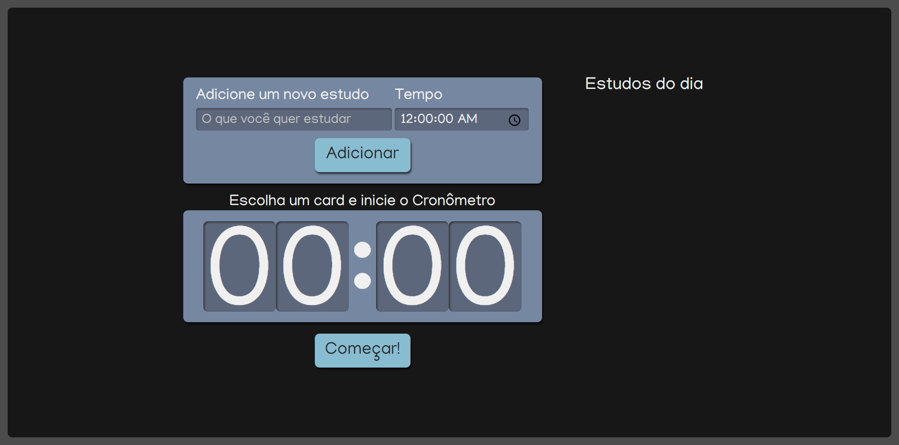

# Alura-Studies


:book: Projeto criado durante o curso de React: escrevendo com Typescript da Alura

<div align="center">
  
</div>

## 📁 Acesso
É possivel baixar o projeto nesse <a href="https://github.com/lucash-barbosa/Alura-Studies/archive/refs/heads/master.zip">link</a>

## 🛠️ Abrir e rodar o projeto

```bash
npm install
npm start

# Abra o programa no navegador pelo link http://localhost:3000/
```
